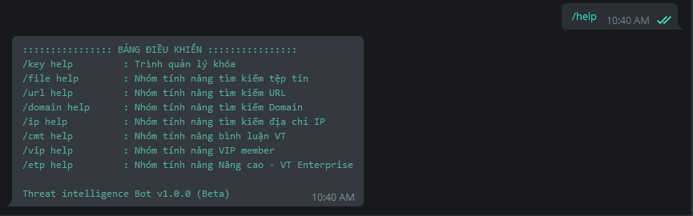

# Docs - Threat Intelligence Bot

- [Docs - Threat Intelligence Bot](#docs---threat-intelligence-bot)
- [1. Bảng điều khiển](#1-bảng-điều-khiển)
- [2. Trình Quản lý khóa](#2-trình-quản-lý-khóa)
  - [2.1. Thêm mới khóa VirusTotal](#21-thêm-mới-khóa-virustotal)
  - [2.2. Xuất thông tin khóa VirusTotal](#22-xuất-thông-tin-khóa-virustotal)
  - [2.3. Bật khóa VirusTotal](#23-bật-khóa-virustotal)
  - [2.4. Xóa khóa VirusTotal](#24-xóa-khóa-virustotal)
  - [2.5. Tải về khóa VirusTotal](#25-tải-về-khóa-virustotal)
- [3. Quản lý Member](#3-quản-lý-member)
  - [3.1. Admin cấp VIP cho Member](#31-admin-cấp-vip-cho-member)
  - [3.2. Admin kiểm tra trạng thái VIP của Member](#32-admin-kiểm-tra-trạng-thái-vip-của-member)
  - [3.3. Admin Thu hồi VIP của Member](#33-admin-thu-hồi-vip-của-member)
  - [3.4. Lịch sử truy vấn của VIP Member](#34-lịch-sử-truy-vấn-của-vip-member)
  - [3.5. Gia hạn VIP Member](#35-gia-hạn-vip-member)
- [4. Nhóm chức năng cho VIP Member](#4-nhóm-chức-năng-cho-vip-member)
  - [4.1. Download tệp tin từ VT](#41-download-tệp-tin-từ-vt)
  - [4.2. VirusTotal Intelligence Search](#42-virustotal-intelligence-search)
- [5. Sử dụng nhóm tính năng VT Enterprise](#5-sử-dụng-nhóm-tính-năng-vt-enterprise)
  - [5.1. Kiểm tra khóa đang dùng hay khóa bất kỳ](#51-kiểm-tra-khóa-đang-dùng-hay-khóa-bất-kỳ)
  - [5.2. Download tệp tin từ VT](#52-download-tệp-tin-từ-vt)
  - [5.3. VirusTotal Intelligence Search](#53-virustotal-intelligence-search)
- [6. Sử dụng Shodan Search Engine](#6-sử-dụng-shodan-search-engine)
  - [6.1. Thêm hoặc Xóa Shodan API Key](#61-thêm-hoặc-xóa-shodan-api-key)
  - [6.2. Kiểm tra thông tin Shodan API Key](#62-kiểm-tra-thông-tin-shodan-api-key)
  - [6.3. Tìm kiếm một IP hay một Host trên Shodan](#63-tìm-kiếm-một-ip-hay-một-host-trên-shodan)
  - [6.4. Tìm kiếm các SubDomain trên Shodan](#64-tìm-kiếm-các-subdomain-trên-shodan)
  - [6.5. Domain to IP và IP to Domain](#65-domain-to-ip-và-ip-to-domain)
  - [6.6. Tìm kiếm nâng cao với các bộ lọc trên Shodan](#66-tìm-kiếm-nâng-cao-với-các-bộ-lọc-trên-shodan)
- [7. VT Hunting](#7-vt-hunting)
  - [7.1. Khởi tạo các Hunting Job](#71-khởi-tạo-các-hunting-job)
  - [7.2. Cấu hình và khởi chạy các Hunting Job](#72-cấu-hình-và-khởi-chạy-các-hunting-job)
  - [7.3. Cập nhật các thay đổi của Hunting Job](#73-cập-nhật-các-thay-đổi-của-hunting-job)


# 1. Bảng điều khiển

Bảng điều khiển của **Threat Intelligence Bot** là một menu giới thiệu tất cả tính năng hiện sẵn có của Bot. Để show bảng điều khiển chúng ta gửi lệnh:

```bash
/help
```



Tại đây chúng ta có các nhóm tính năng được phân loại theo các `command` riêng biệt. Ví dụ nhóm tính năng nâng cao dành cho người dùng có **Premium/Private VirusTotal API Key** có command là: `/etp`

Để hiển thị trợ giúp cho một nhóm tính năng bất kỳ. Chúng ta gửi lệnh theo cú pháp: `</command>` hoặc `</command> help`. Ví dụ:

```bash
/etp
# Hoặc
/etp help
```


💡 MẸO khi sử dụng Bot: Chỉ cần gõ `/` và **một vài ký tự đầu** tiên của `command` sau đó nhấn phím `TAB` trên bàn phím. Khi đó Bot sẽ tự động hoàn thành `command` mà bạn không nhất thiết phải gõ toàn bộ command.


# 2. Trình Quản lý khóa

Để có thể sử dụng Bot, việc đầu tiên cần phải làm đó là **thiết lập khóa cá nhân** với Bot. Hiện tại Bot đã hỗ trợ đa người dùng, mỗi khóa cá nhân sẽ được định danh kèm với Telegram UserID. Như vậy với mỗi tài khoản người dùng Telegram **có thể thiết lập nhiều khóa** VirusTotal nhưng các khóa này **không được trùng nhau**. Bắt đầu thiết lập khóa với Bot, bạn nhập lệnh sau để nhận trợ giúp:

```bash
/key help
```


## 2.1. Thêm mới khóa VirusTotal

Để thêm mới một khóa VirusTotal. Bạn sử dụng lệnh: `/key add <key>`. Trong đó: Tham số `add` là hành động thực hiện và `<key>` là chuỗi giá trị khóa VirusTotal của bạn. Ví dụ:

```bash
/key add <your-api-key>
```


Trường hợp bạn cung cấp khóa VT không hợp lệ hoặc khóa đã được thêm trước đó, Bot sẽ thông báo như hình trên.

## 2.2. Xuất thông tin khóa VirusTotal

Để kiểm tra thông tin về các khóa VT mà bạn đã thêm. Gửi lệnh sau cho Bot:

```bash
# Xuất thông tin tất cả khóa VirusTotal đã thiết lập:
/key dump

# Xuất thông tin cụ thể một khóa VirusTotal đã thiết lập:
/key dump <your-api-key>
```


Giá trị `is_private` cho biết khóa đó thuộc loại nào: 

- `"is_private": 1` ⇒ Cho biết đây là **Private VT Key**
- `"is_private": 0` ⇒ Cho biết đây là **Public VT Key**

Giá trị `is_enable` cho biết trạng thái của khóa đó:

- `"is_enable": 1` ⇒ Cho biết khóa đang được **BẬT**
- `"is_enable": 0` ⇒ Cho biết khóa đang bị **TẮT**

## 2.3. Bật khóa VirusTotal

Theo mặc định, sau khi thiết lập khóa VT với Bot thì khóa đó ở trạng thái bị **TẮT** (tức là: `"is_enable": 0`). Để bắt đầu sử dụng các tính năng của Bot, cần phải **BẬT** một khóa lên. Gửi lệnh sau cho Bot:

```bash
/key enable <your-api-key>
```


Giá trị `is_enable` chuyển sang `1` báo hiệu khóa VT đã được bật.

💡 **Lưu ý:** Tại một thời điểm chỉ có **duy nhất** một khóa VT được BẬT. Khi bạn cố gắng BẬT một khóa khác lên thì khóa đc bật trước đó sẽ chuyển sang trạng thái TẮT.


## 2.4. Xóa khóa VirusTotal

Để xóa khóa VT đã thiết lập với Bot trước đó. Bạn gửi lệnh sau cho Bot:

```bash
# Xóa một khóa VT đã thêm trước đó:
/key del <your-api-key>

# Xóa tất cả các khóa có trong danh sách:
/key del
```


## 2.5. Tải về khóa VirusTotal

Để tiện lợi cho việc lưu trữ các khóa đã thiết lập với Bot. Bạn có thể tải về tệp tin chứa cấu hình các khóa. Gửi lệnh sau cho Bot:

```bash
/key export
```


Bây giờ bạn đã có thể tải về file cấu hình các khóa VT và lưu nó ở một nơi an toàn trên máy tính của bạn.

# 3. Quản lý Member

Để linh động trong quá trình sử dụng Bot. Người dùng sở hữu khóa **VT Private** (sau đây gọi là **Admin**) có thể cấp một số quyền mà chỉ có Private Key mới có cho người dùng chỉ sở hữu khóa **VT Public** (sau đây gọi là **Member**). Hiện tại Bot hỗ trợ cấp quyền `download` một tệp tin từ VT cho Member theo `02` hình thức sau, gọi chung là cấp `VIP` 🤣:

1. **Cấp VIP theo ngày**: Member trong thời hạn sử dụng của mình tính theo ngày có thể download không giới hạn số lần từ VT.
2. **Cấp VIP theo số lần request**: Member sử dụng số lần download trong phạm vi đc cấp, nếu download bị lỗi Member vẫn được bảo toàn lượt download đó mà không bị trừ. Nếu hết số lượt download, Member liên hệ Admin để cấp tiếp.

Giao diện chức năng VIP của **Admin**:


Giao diện chức năng VIP của **Member**:


## 3.1. Admin cấp VIP cho Member

Member muốn được cấp VIP cần liên hệ và gửi cho **Admin** thông tin về khóa VT Public của mình kèm Telegram UserID. Member thực hiện các bước sau:

1. Thêm mới khóa VT
2. Xuất thông tin khóa VT
3. Gửi thông tin khóa Public VT đã thêm cho Admin. Ví dụ:

```json
[
    {
        "api_key": "1111111111111111111111111111111111111111111111111111111111111111",
        "chat_id": "775551874",
        "username": "lehonghai",
        "is_private": 0,
        "is_enable": 1
    }
]
```

Admin sau khi có được thông tin gồm: `api_key` và `chat_id` của Member. Có thể lựa chọn các phương thức cấp `VIP` sau:

**3.1.1. Cấp VIP theo số ngày cho một Member:**

```bash
/vip day <number> <api_key> <chat_id>
```

**Trong đó:**

- `<number>`: Số ngày muốn cấp cho Member
- `<api_key>`: Khóa VT Public của Member
- `<chat_id>`: Telegram UserID của Member

Demo: **Cấp VIP 03 ngày** cho Member


**3.1.2. Cấp VIP theo số lượt truy vấn cho Member**

```bash
/vip req <number> <api_key> <chat_id>
```

**Trong đó:**

- `<number>`: Số lượt truy vấn muốn cấp cho Member
- `<api_key>`: Khóa VT Public của Member
- `<chat_id>`: Telegram UserID của Member

Demo: **Cấp VIP 10 lượt** truy vấn (download) cho Member


## 3.2. Admin kiểm tra trạng thái VIP của Member

Tại giao diện chức năng VIP của Admin. Để kiểm tra trạng thái VIP của các Member cũng như mức độ đã sử dụng của Member. Gửi lệnh sau cho Bot:

```bash
# Kiểm tra trạng thái của một Member
/vip dump <api_key>

# Hoặc: Kiểm tra trạng thái của tất cả Member
/vip dump
```


Trong đó:

- `member_key`: Khóa VT của Member
- `member_chat_id`: Telegram UserID của Member
- `member_username`: Telegram Username của Member
- `admin_username`: Telegram Username của Admin
- `member_type`: Loại VIP Member (`datetime`: VIP theo ngày, `requests`: VIP theo lượt download)
- `member_start_time`, `member_end_time`: Thời gian bắt đầu và kết thúc VIP của Member
- `member_query_used`, `member_query_allowed`: Số lượt download đã dùng và tổng số lượt download của Member

## 3.3. Admin Thu hồi VIP của Member

Để ngừng cấp VIP cho một Member. Admin tiến hành gửi lệnh sau:

```bash
/vip del <api_key> <chat_id>
```


## 3.4. Lịch sử truy vấn của VIP Member

Bot hiện đã có tính năng theo dõi hoạt động của VIP Member. Admin có thể sử dụng tính năng này để theo dõi số lần truy vấn thành công, thất bại của Member. Biết được Member đã search những gì và download những tệp nào.

Gửi lệnh sau để nhận Menu trợ giúp từ Bot

```bash
/vip
# Hoặc
/vip help
```


Có 02 hình thức xem lại lịch sử truy vấn của Member như sau:

- Xem logs của tất cả Member mà mình đang quản lý. Cú pháp: `/vip log`
- Xem logs của một Member cụ thể theo Telegram Username. Cú pháp: `/vip log <username>`

Và theo mặc định thì Bot sẽ gửi về kết quả của 20 bản ghi logs gần nhất theo thứ tự thời gian từ cũ nhất ⇒ mới nhất.

**3.4.1. Xem logs của tất cả Member:**

```bash
/vip log
```


**3.4.2. Xem logs của một Member:**

```bash
/vip log lehonghai
```


## 3.5. Gia hạn VIP Member

Trường hợp Member hết hạn sử dụng VIP, để không phải xóa Member đi xong tạo lại có thể sử dụng chức năng Gia hạn VIP, áp dụng cho cả 2 loại VIP Member là theo số ngày được cấp phép và theo Số lượt truy vấn được cấp.


Cú pháp như sau:

```powershell
/vip ren <number> <key> <chat_id>
```

**Trong đó:**

- `number`: Số lượt truy vấn hoặc số ngày muốn tăng thêm cho Member
- `key`: Khóa VT của Member. Sử dụng `/vip dump` để xem thông tin các Member mình đã cấp VIP.
- `chat_id`: Telegram ID của Member. Cũng sử dụng `/vip dump` để xem thông tin này.

**Demo:**

Giả sử hiện tại đang cấp VIP cho 2 Member:

- member 1: Có ngày hết hạn VIP là: `2021-11-11 21:04:19`
- member 2: Có tổng số lượt truy vấn là: `20`


Thực hiện gia hạn `thêm 15 ngày` cho Member 1 và `thêm 30 lượt` truy vấn cho Member 2:


Kiểm tra kết quả: Member 1 được gia hạn thêm từ `2021-11-11 21:04:19` lên thành `2021-11-26 21:04:19`. Còn Member 2 gia hạn thêm từ `20` lên `50`:


# 4. Nhóm chức năng cho VIP Member

Để biết VIP Member hiện tại được sử dụng những chức năng gì. Bạn gửi một trong các lệnh sau cho Bot:

```bash
/vip
/vip help
```


## 4.1. Download tệp tin từ VT

Sau khi Member được cấp quyền download tệp tin từ VT. Member thực hiện gửi lệnh sau để nhận URL download từ Bot:

```bash
/vip dl <hash>
```

Trong đó: `<hash>` là giá trị băm của tệp muốn download. Hiện tại Bot hỗ trợ 3 loại băm là: `MD5`, `SHA1`, `SHA256`


💡 Bot sẽ gửi link download cho Member, link download có hiệu lực trong vòng 60 phút và không giới hạn số lần click download trong 60 phút này. Quá thời gian 60 phút sẽ không thể download tệp được nữa.


## 4.2. VirusTotal Intelligence Search

VT Search Intelligence là tính năng mới dành cho VIP Member. Member được cấp quyền thực hiện tính năng này có thể Search nâng cao như tính năng dành cho Admin. Để thực hiện Search Intelligence, bạn gửi lệnh theo cú pháp sau cho Bot:

```bash
/vip si <query>
```

Cách thực hiện và Demo xem phần 5.3. VirusTotal Intelligence Search. **Lưu ý sử dụng đúng cú pháp là:** `/vip si <query>`. **KHÔNG** sử dụng cú pháp `/etp si <query>` vì cú pháp đó dành cho Admin.

# 5. Sử dụng nhóm tính năng VT Enterprise

## 5.1. Kiểm tra khóa đang dùng hay khóa bất kỳ

Kiểm tra thông tin khóa VT đang sử dụng

```bash
/etp info
```


Kiểm tra thông tin một khóa VT bất kỳ

```bash
/etp info <api_key>
```


## 5.2. Download tệp tin từ VT

**Download tệp từ VT**

```bash
/etp dl <hash/url>
```

**Trong đó:**

- `<hash/url>`: Giá trị băm (`MD5`, `SHA1`, `SHA256`) hoặc địa chỉ `URL` đến VirusTotal Sample. Chức năng này hỗ trợ gửi nhiều hash hoặc URL. tuy nhiên không được vượt quá 10.


💡 Với tệp có kích từ 5 MB trở lên. Bot sẽ không thực hiện download mà sẽ gửi link download. Link download có hiệu lực trong 60 phút.


**Nhận URL Download tệp từ VT**

```bash
/etp dlu <hash/url>
```

Trong đó:

- `<hash/url>`: Giá trị băm (`MD5`, `SHA1`, `SHA256`) hoặc địa chỉ `URL` đến VirusTotal Sample. Chức năng này hỗ trợ gửi nhiều hash hoặc URL. tuy nhiên không được vượt quá 10.


## 5.3. VirusTotal Intelligence Search

**VirusTotal Intelligence Search** không chỉ áp dụng cho đối tượng `Tệp tin` mà còn cho cả `Domain`, `IP Adress` và `URL`. Hiện tại **Bot đã hỗ trợ Intelligence Search với `Tệp tin`**.

Tham khảo cú pháp cũng như cách thức tạo câu truy vấn cho **Intelligence Search:**

- **VirusTotal Intelligence Introduction**: [https://support.virustotal.com/hc/en-us/articles/360001387057-VirusTotal-Intelligence-Introduction](https://support.virustotal.com/hc/en-us/articles/360001387057-VirusTotal-Intelligence-Introduction)
- **File search modifiers**: [https://support.virustotal.com/hc/en-us/articles/360001385897-VT-Intelligence-search-modifiers](https://support.virustotal.com/hc/en-us/articles/360001385897-VT-Intelligence-search-modifiers)

**Demo 1:** Search các tệp **PDF** có khả năng là **Malicious documents.** Các tệp này có nhúng **JavaScript** bên trong:

```bash
/etp si type:pdf tag:autoaction tag:js-embedded
```


**Demo 2:** Search các tệp **Office Documents** được VT phát hiện là có mã khai thác **Microsoft Word** . Lỗ hổng có định danh là: `CVE-2017-11882` hoặc `CVE-2018-0802`

```bash
/etp si type:doc AND (tag:cve-2017-11882 OR tag:cve-2018-0802)
```


💡 Theo mặc định số lượng kết quả trả về khi Intelligence Search là: `05`


# 6. Sử dụng Shodan Search Engine

Hiện tại Threat Intelligence Bot đã tích hợp **Shodan Search Engine**. Sử dụng lệnh `/shodan` hoặc `/shodan help` để nhận trợ giúp cho nhóm tính năng này:

```bash
/shodan
/shodan help
```


## 6.1. Thêm hoặc Xóa Shodan API Key

Để có thể thao tác được với các chức năng của Shodan, bạn cần phải thêm Shodan API Key. Sử dụng lệnh sau để thêm khóa mới cho Shodan:

```bash
/shodan add <key>
```


Hiện tại tính năng quản lý khóa của Shodan chỉ hỗ trợ một API Key cho một người dùng ở một thời điểm. Chưa hỗ trợ một người dùng với nhiều Shodan API Key.

Để xóa Shodan Key đã thêm trước đó, sử dụng lệnh sau:

```bash
/shodan del
```


## 6.2. Kiểm tra thông tin Shodan API Key

Để kiểm tra thông tin Shodan API Key đang sử dụng. Bạn gửi lệnh sau cho Bot:

```bash
/shodan info
```


Để kiểm tra thông tin một Shodan API Key bất kỳ. Bạn gửi lệnh sau cho Bot:

```bash
/shodan info <key>
```


Tính năng này sẽ không yêu cầu người dùng Bot phải thiết lập Shodan Key trước đó.

## 6.3. Tìm kiếm một IP hay một Host trên Shodan

Trong nhiều tình huống cần kiểm tra nhanh một địa chỉ IP, có thể sử dụng các **Threat Intelligence Platform** như **Shodan** hoặc **VirusTotal**. Thông tin thu được từ các platform này có thể hữu ích trong nhiều bài toán, một số thông tin có được như: Nhà cung cấp, Quốc gia, các hostnames, domains liên quan, các cổng đang mở, thậm chí là lỗ hổng bảo mật của dịch vụ đang chạy,.v.v.. Để tìm kiếm một địa chỉ IP, bạn gửi lệnh sau cho Bot:

```bash
/shodan ip <ip-address>
```


## 6.4. Tìm kiếm các SubDomain trên Shodan

Để tìm kiếm các SubDomain của một Domain. Bạn gửi lệnh sau cho Bot:

```bash
/shodan sub <domain>
```


## 6.5. Domain to IP và IP to Domain

Để tìm kiếm địa chỉ IP của một hay nhiều Domain, bạn gửi lệnh sau cho Bot:

```bash
/shodan dti <domain1,domain2>
```


Để tìm kiếm xem có domain nào đang sử dụng địa chỉ IP đã biết, bạn gửi lệnh sau cho Bot:

```bash
/shodan itd <ip1,ip2>
```


## 6.6. Tìm kiếm nâng cao với các bộ lọc trên Shodan

Đây là tính năng rất mạnh của Shodan Search Engine. Bot hiện tại đã hỗ trợ bạn gửi các truy vấn (query) kèm các bộ lọc để tìm kiếm trên Shodan. Một số lưu ý như sau khi gửi truy vấn cho Bot:

- Càng sử dụng nhiều bộ lọc (Filter) thì càng cho nhiều kết quả chính xác. Nên sử dụng
- Tính năng này sẽ mất nhiều thời gian do phải đợi máy chủ của Shodan phản hồi. Trong lúc đợi, không nên thao tác gì tránh Bot quá tải
- **KHÔNG** nên chỉ sử dụng **MỘT** bộ lọc chung chung. Ví dụ: `product:Apache`, `port:22`,.. vì khi đó Shodan sẽ tìm kiếm rất lâu, mất thời gian đợi phản hồi và dữ liệu trả về sẽ cực lớn (Tất nhiên đã có limit theo mặc định nhưng sẽ phải đợi rất lâu). Có thể dẫn đến Time Out.
- NÊN kết hợp nhiều bộ lọc để giảm tải cũng như giảm thời gian chờ đợi. Ví dụ: `product:Apache port:80 country:VN`
- Các kết quả trả về từ Shodan rất dài dòng và nhiều, kết quả Bot hiển thị là đã được lược bỏ và chỉ lấy những thông tin tổng quát.

Một số tài liệu tham khảo khi sử dụng tính năng Search nâng cao:

1. Filter Reference: [https://www.shodan.io/search/filters](https://www.shodan.io/search/filters)
2. Search Query Examples: [https://www.shodan.io/search/examples](https://www.shodan.io/search/examples)
3. Facet Analysis: [https://beta.shodan.io/search/facet](https://beta.shodan.io/search/facet)

Để sử dụng tính năng tìm kiếm nâng cao với Shodan. Bạn gửi lệnh sau cho Bot:

```bash
/shodan search <query>
```

**Demo 1:** Tìm kiếm các máy chủ tồn tại lỗ hổng bảo mật có định danh: [CVE-2019-19781](https://nvd.nist.gov/vuln/detail/CVE-2019-19781) tại Việt Nam.

```bash
/shodan search vuln:CVE-2019-19781 country:VN
```


**Demo 2:** Tìm kiếm các máy chủ chạy Apache trên cổng 80, của nhà mạng Viettel

```bash
/shodan search product:Apache port:80 country:"VN" org:"Viettel Group"
```


# 7. VT Hunting

Threat Intelligence Bot đã có tính năng mới cho phép người dùng thực hiện: Lập lịch, theo dõi các hash, search intelligence,.v.v.. theo định kỳ. Và nhận thông báo khi có kết quả từ Bot. Đây là một tính năng mới thay thế cho tính năng [VT HUNTING (Retrohunt, Livehunt)](https://developers.virustotal.com/reference#retrohunt) có sẵn của VirusTotal, nó khắc phục được các nhược điểm sau:

- Cảnh báo trực tiếp đến người dùng qua Telegram thay vì qua Email vì dễ bị đánh vào Spam.
- Không bị lộ lọt các Hunting Job với người khác. Vì một Private API key có thể đang được sử dụng bởi nhiều người, những người này có thể biết đc API Key này đang thiết lập các Hunting Job nào, dẫn đến việc có thể sẽ bị khóa API Key.
- Linh động và tùy biến cao: Nhiều cách thức Monitor (Hash, Query), Lập lịch theo thời gian tùy ý,.v.v...

Để nhận Menu trợ giúp từ Bot cho tính năng VT Hunting. Bạn gửi lệnh sau cho Bot:

```bash
/hunt
# Hoặc
/hunt help
```


## 7.1. Khởi tạo các Hunting Job

Hiện tại chức năng VT Hunting hỗ trợ tạo **03** loại Hunting Job sau:

1. **Hashes Hunting Job:** Tạo Job với các Hashes cần theo dõi một cách thủ công. Các Hashes ngăn cách nhau bằng dấu `khoảng trắng` hoặc `xuống dòng`
2. **URL Hunting Job:** Tạo Job theo dõi một URL. URL này chứa các Hashes và số lượng các Hashes có thể thay đổi theo thời gian
3. **Search Query Hunting Job:** Tạo Job thực hiện truy vấn nâng cao (Search Intelligence). Tính hiệu quả phụ thuộc vào độ sáng tạo của người viết câu truy vấn lên VirusTotal.

👷 **Tạo Hash Hunting Job**

```bash
/hunt hash <hash1 hash2 hash3>
```


👷 **Tạo URL Hunting Job**

```bash
/hunt url <url>
```

Giả sử ta cần Monitor một URL chứa các hash như sau: [https://binary.ninja/js/hashes.js](https://binary.ninja/js/hashes.js)


👷 **Tạo Search Query Hunting Job**

```bash
/hunt si <query>
```


**🔍 Bây giờ để xem lại các Hunting Job bạn đã tạo trước đó. Gửi lệnh sau cho Bot:**

```bash
/hunt dump
# Hoặc
/hunt dump <hunt_id>
```


Với lệnh `/hunt dump` chúng ta chỉ có thể xem cấu hình ngắn gọn của các Hunting Job đã tạo. Để xem cấu hình chi tiết hơn. Sử dụng lệnh: `/hunt dump <hunt_id>`


**Giải thích một vài thông số:**

- `id`: HuntID của một Hunting Job, con số này là duy nhất. Sinh tự động và trả về cho người dùng sau khi Hunting Job được tạo
- `type`: Hunting Job Type: hash, url hoặc query
- `create_time`: Thời gian Hunting Job được tạo
- `status`: Mặc định trạng thái của Hunting Job là `OFF` sau khi được tạo. Khi thiết lập thời gian chạy thì nó sẽ chuyển thành `ON`.
- `run_at`: Thời gian chạy trong ngày của Hunting Job. Khi chưa thiết lập thì giá trị này sẽ là trống.
- `num_of_hashes` và `content`: Số lượng các hash và nội dung cụ thể các hashes đã thêm.
- `source`: Cho biết Hunting Job này được tạo thủ công (manual) hay được lấy từ một URL
- `last_run`: Thời điểm lần cuối cùng Hunting Job này chạy. Mặc định giá trị `1970-01-01 07:00:00` cho biết Job này chưa được chạy lần nào.

Trường hợp muốn xem lại tất cả các hashes đang theo dõi và các hashes đã tìm thấy mà không cần nhập vào **HuntID**. Bạn gửi lệnh sau cho Bot:

```bash
/hunt export
```


**Trong đó:**

- `hashes_monitor`: Số hashes đang theo dõi trên VT
- `hashes_found`: Số hashes đã tìm thấy trên VT

Nếu số lượng hashes quá nhiều. Bot sẽ export sang dạng tệp tin `*.json` và gửi cho bạn.

Và cuối cùng để xóa một Hunting Job. Bạn gửi lệnh sau cho Bot:

```bash
/hunt del <hunt_id>
```


## 7.2. Cấu hình và khởi chạy các Hunting Job

**7.2.1 Cấu hình (Lập lịch) thời gian chạy cho các Hunting Job**

Trước tiên, ta xuất thông tin các Hunting Job đã tạo, xem cấu hình hiện tại và cũng để lấy HuntID của các Job.


**⏲️ Lập lịch chạy 01 lần mỗi ngày**

```bash
/hunt stime <hunt_id> <time>
```

Demo: Đặt lịch chạy Hunting Job vào `01 giờ 15 phút` sáng sớm mỗi ngày.


**⏲️ Lập lịch chạy nhiều lần mỗi ngày**

```bash
/hunt stime <hunt_id> <time1 time2 time3>
```

Demo: Đặt lịch chạy Hungting Job vào lúc: `02 giờ` sáng, `11 giờ 30 phút` trưa và `23 giờ 15` phút tối của mỗi ngày.


Cùng xem lại các mốc thời gian đã cấu hình cho Hunting Job: Để ý thông số cấu hình: `run_at` đã được thay đổi.


**7.2.2. Khởi chạy các Hungtin Job**

Khi đã hoàn tất việc cấu hình các Hunting Job theo ý muốn. Bạn có thể bắt đầu cho chạy các Hungtin Job này. Ngoài ra, Bot cũng hỗ trợ người dùng kiểm tra, theo dõi các Hunting Job đang chạy, đồng thời có thể buộc dừng các Hunting Job này theo yêu cầu của người dùng.

**🎛️ Khởi chạy các Hunting Job - START**

```bash
/hunt start
```


**🎛️ Kiểm tra trạng thái các Hunting Job - STATUS**

```bash
/hunt status
```


Với Hunting Job có ID `1631876489`. Do chúng ta trước đó đã lập lịch chạy ở các khoảng thời gian `11:30:00`, `02:00:00` và `23:15:00`. Nên khi kiểm tra với `/hunt status` sẽ thấy xuất hiện thông số `number` trả về `3`.

**🎛️ Buộc dừng các Hunting Job - STOP**

```bash
/hunt stop
```


**🍰 Nhận kết quả sau khi chạy của Hunting Job**

Sau khi đã lập lịch các Hunting Job chạy vào các khoảng thời gian theo ý muốn của bạn. Công việc còn lại lúc này chỉ là chờ đợi. Giả sử bạn đặt lịch cho Job chạy vào lúc đêm, khi đó bạn đã đi ngủ. Khi đến thời điểm đã lập lịch, Bot chạy lấy kết quả các hash nó tìm thấy và nếu có nó sẽ gửi tin nhắn cho bạn.

Lưu ý rằng, các hashes sẽ được lưu vào Cơ sở dữ liệu để thuận tiện cho việc tra cứu sau này và các hash mà Bot đã tìm thấy nó sẽ không cảnh báo lại đến bạn ở các lần chạy vào hôm sau.


**🍰 Kiểm tra lại kết quả của các lần chạy Hunting Job**

```bash
/hunt log <hunt_id>
```


## 7.3. Cập nhật các thay đổi của Hunting Job

**🔨 Cập nhật thêm các Hashes**

Để cập nhật thêm các Hashes của một **Hunting Job Hash**. Bạn gửi lệnh sau cho Bot:

```bash
/hunt update <hunt_id> <hashes>
```


Hình trên cho thấy, tôi muốn cập nhật thêm `7 hash` mới vào một Hunting Job đã tạo trước đó, và trong số đó có `2 hash` đã tồn tại trước đó rồi. Vậy sẽ chỉ có `5 hash` mới được thêm.


Với các **Hunting Job URL**, qua thời gian có thể sẽ được thêm mới các hash. Để cập nhật, bạn gửi lệnh sau cho Bot, nó sẽ tự động truy vấn đến URL và trích xuất các hashes mới được thêm:

```bash
/hunt update <hunt_id>
```


**🔨 Cập nhật thời gian chạy của các Hunting Job**

Để thay đổi thời gian chạy (lập lịch) của các Hunting Job. Bạn thực hiện tương tự như lúc thiết lập thời gian. Lúc này mốc thời gian mới bạn thiết lập sẽ ghi đè lên các mốc thời gian cũ. Cú pháp:

```bash
/hunt stime <hunt_id> <times>
```

Và cuối cùng để áp dụng các thay đổi. Bạn cần dừng các Hunting Job đang chạy sau đó khởi động lại chúng.

```bash
/hunt stop
/hunt start
```